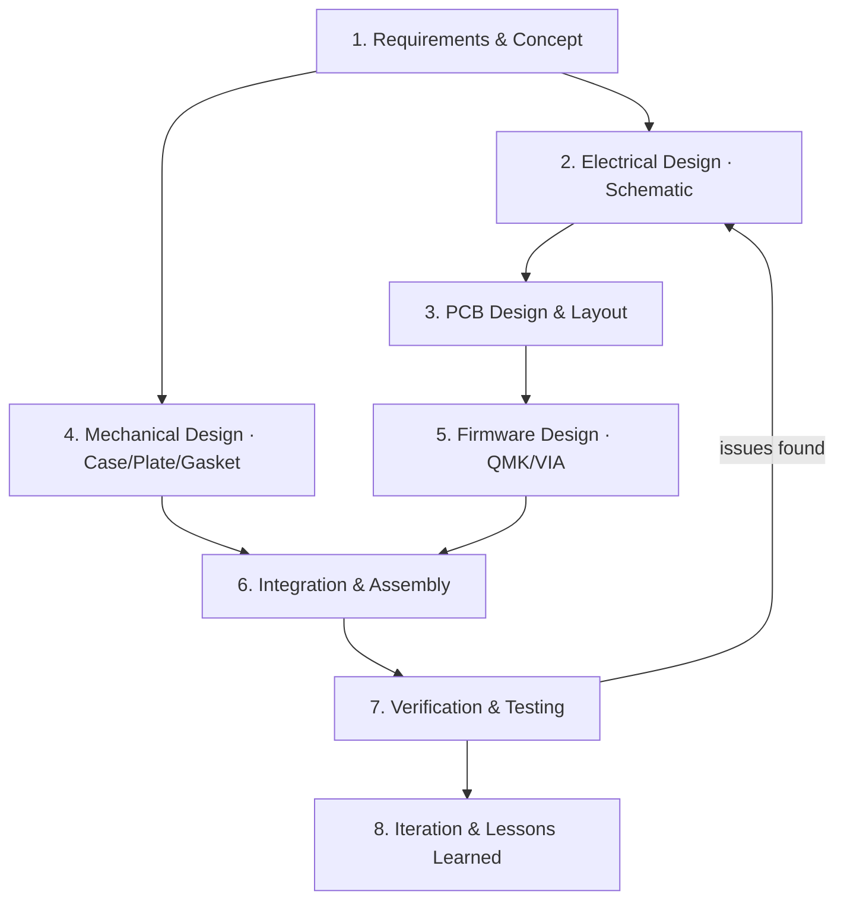

# ⌨️ Prototype Carbon — A Custom 65% Mechanical Keyboard

A from-scratch **65% keyboard** designed, built, and programmed as a complete system:
**67 keys · 3u split spacebars · gasket mount · acrylic shell · hot-swap · per-key RGB · QMK + VIA.**

> 🎥 **Watch the demo**
>
> [](https://www.youtube.com/watch?v=WMbd48JGXQo&ab_channel=XinlinWu)

---

## 📖 Project Overview

Prototype Carbon is a custom mechanical keyboard engineered through a full systems design cycle —
from requirements and block-level architecture, through electrical and mechanical design,
firmware development, integration, and verification.

| System | Spec |
|---|---|
| Layout | 65%, 67 keys, standard stagger |
| Spacebars | **2× 3u split spacebars** |
| Switch matrix | 5 rows × 15 cols, `COL2ROW` diode direction |
| MCU | ATmega32u4-AU (QFP-44) @ 16 MHz |
| Connectivity | USB-C |
| Firmware | QMK with VIA remapping enabled |
| RGB | 75× WS2812B (67 per-key + 8 underglow) on pin `B0` |
| Switches | 67× Kailh hot-swap sockets |
| Mounting | Gasket mount, layered acrylic shell |
| Diodes | 67× SOD-123F |

---

## 🎯 Design Requirements

| ID | Requirement |
|---|---|
| R1 | 65% form factor with dedicated arrow cluster and nav column |
| R2 | Two **3u split spacebars** for extra thumb-layer inputs |
| R3 | Fully **hot-swappable** — no switch soldering required |
| R4 | **Per-key RGB** backlighting plus underglow, driven by a single data line |
| R5 | USB-C connectivity and standard HID (no driver install) |
| R6 | **Remappable in real time** via VIA |
| R7 | Soft, gasket-mounted typing feel with a stacked acrylic case |
| R8 | A dedicated function layer exposing F1–F12 and RGB controls |

---

## 🏗️ System Architecture

```
┌──────────────────────────────────────────────────────────────────────────┐
│                               HOST (PC)                                   │
│                        USB-C  ·  HID keyboard                              │
└───────────────────────────────────┬──────────────────────────────────────┘
                                    │ USB
┌───────────────────────────────────▼──────────────────────────────────────┐
│  ATmega32u4-AU @ 16 MHz            ┌─────────────────────────────────────┐ │
│  QMK firmware (+VIA)               │  RGB matrix (WS2812B, pin B0)       │ │
│                                    │  75 LEDs: 67 per-key + 8 underglow  │ │
│  ┌───────────────┐                 └─────────────────────────────────────┘ │
│  │ 5×15 switch    │                                                        │
│  │ matrix (COL2ROW)│   ← 67× Kailh hot-swap sockets + SOD-123F diodes      │
│  └───────────────┘                                                        │
│   (EC11 rotary encoder — routed but not usable, see Known Issues)          │
└──────────────────────────────────────────────────────────────────────────┘
```

**Signal flow:** key press → switch matrix → MCU scans rows/cols (COL2ROW) → QMK debounces and
maps the keycode → USB HID report to host. In parallel, QMK's RGB matrix drives all 75 WS2812B
LEDs over a single data pin.

---

## 🔁 Systems Design Process

The project followed an iterative systems-design workflow. Each phase produced the design artifact
that fed the next phase, and integration testing looped findings back into the design.



### Phase 1 — Requirements & Concept
Defined the layout, keymap, and physical form factor before any hardware was committed.

- **Layout spec** (KLE): [`layout.txt`](./layout.txt) — the 67-key 65% layout with 3u split spacebars
- **Layout model**: [`protocarbon.json`](./protocarbon.json) — keyboard-layout-editor JSON
- **Keymap matrix**: [`prototypeCarbonVIA.json`](./prototypeCarbonVIA.json) — 5×15 matrix and VIA layout

### Phase 2 — Electrical Design (Schematic)
Designed the schematic around the ATmega32u4 with a 16 MHz crystal, USB-C, COL2ROW matrix,
per-key RGB chain, and decoupling.

- **Schematic**: [`SCH_prototypeCarbon_2025-07-03.json`](./SCH_prototypeCarbon_2025-07-03.json)
- **Bill of Materials**: [`BOM_prototypeCarbon_2025-07-03.csv`](./BOM_prototypeCarbon_2025-07-03.csv)
- **Shopping list**: [`prototypeCarbonShoppingList - BOM_prototypeCarbon_2025-07-03.csv`](./prototypeCarbonShoppingList%20-%20BOM_prototypeCarbon_2025-07-03.csv)

### Phase 3 — PCB Design & Layout
Routed the board, placed the hot-swap sockets and per-key LEDs, and generated manufacturing outputs.

- **PCB design**: [`PCB_PCB_prototypeCarbon_2025-07-03.json`](./PCB_PCB_prototypeCarbon_2025-07-03.json)
- **PCB outline (DXF)**: [`PCB_prototypeCarbon_2025-07-05.dxf`](./PCB_prototypeCarbon_2025-07-05.dxf)
- **PCB outline, revised**: [`PCB_prototypeCarbon_2025-07-05 gai.dxf`](./PCB_prototypeCarbon_2025-07-05%20gai.dxf)
- **Gerber files (fabrication)**: [`Gerber_prototypeCarbon_PCB_prototypeCarbon_2025-07-03.zip`](./Gerber_prototypeCarbon_PCB_prototypeCarbon_2025-07-03.zip)

### Phase 4 — Mechanical Design (Case, Plate & Gasket)
Designed the gasket-mount stack and layered acrylic enclosure to match the PCB outline.

- **Acrylic shell stack (DWG)**: [`prototypeCarbonGasketShell.dwg`](./prototypeCarbonGasketShell.dwg)
- **Acrylic plates (DWG)**: [`prototypeCarbonAcrylicPlates.dwg`](./prototypeCarbonAcrylicPlates.dwg)
- **Stack drawing (DWG)**: [`stack.dwg`](./stack.dwg)
- **Switch plate (DWG)**: [`plate1.dwg`](./plate1.dwg) · (DXF) [`plate1.dxf`](./plate1.dxf)
- **Gasket (DWG)**: [`gasket.dwg`](./gasket.dwg) · [`prototypeCarbonGasket.dwg`](./prototypeCarbonGasket.dwg)

### Phase 5 — Firmware Design (QMK + VIA)
Wrote the QMK port — matrix pins, COL2ROW, WS2812B RGB matrix, and a function layer —
and enabled VIA for real-time remapping.

- **Firmware directory**: [`qmk_firmware/keyboards/prototypeCarbon`](./qmk_firmware/keyboards/prototypeCarbon)
- **Hardware config**: `config.h`, `rules.mk` (matrix pins, RGB, VIA)
- **Keymaps**: `keymaps/default/keymap.c` and `keymaps/VIA/keymap.c`
- **Layer-2 keybind reference**: [`layer2keybind.JPG`](./layer2keybind.JPG)

### Phase 6 — Integration & Assembly
Soldered the SMD electronics (MCU, diodes, caps, LEDs, USB-C), installed hot-swap sockets,
and stacked the case with M2 hardware.

- `24×` M2 × 4 mm screws
- `12×` M2 × 14 mm double-headed copper standoffs

### Phase 7 — Verification & Testing
Flashed the firmware and validated the system end-to-end.

- ✅ Key matrix scan across all 67 keys
- ✅ RGB chain (67 per-key + 8 underglow) on a single data pin
- ✅ VIA detection and live remapping
- ❌ EC11 rotary encoder — see Known Issues below

### Phase 8 — Iteration & Lessons Learned
Integration testing surfaced a routing error (EC11 → AREF). It was documented, isolated, and
worked around; the fix would be a schematic/PCB re-spin (see below).

---

## 🛠️ How to Build This Keyboard

1. **🧾 Print the PCB** — [`Gerber_prototypeCarbon_PCB_prototypeCarbon_2025-07-03.zip`](./Gerber_prototypeCarbon_PCB_prototypeCarbon_2025-07-03.zip)
2. **🖨️ Print the case & plates** — [`prototypeCarbonGasketShell.dwg`](./prototypeCarbonGasketShell.dwg) · [`gasket.dwg`](./gasket.dwg)
3. **🔌 Order electrical components** — [`BOM_prototypeCarbon_2025-07-03.csv`](./BOM_prototypeCarbon_2025-07-03.csv), plus:
   - `1×` ATmega32u4AU microcontroller
   - `67×` Kailh hot-swap sockets
   - `67×` 6028RGBC-WS2812B RGB LEDs
4. **🎹 Buy keyboard parts** — `67×` switches, `67×` keycaps, `24×` M2 × 4 mm screws, `12×` M2 × 14 mm standoffs
5. **🔧 Assemble** — reference the PCB while soldering and mind LED/MCU pin orientation
6. **💻 Compile firmware** — use QMK_MSYS in [`qmk_firmware/keyboards/prototypeCarbon`](./qmk_firmware/keyboards/prototypeCarbon)
7. **🚀 Flash** — upload the compiled firmware with QMK Toolbox
8. **🧩 Configure in VIA** — load [`prototypeCarbonVIA.json`](./prototypeCarbonVIA.json) to view/remap the keymap

---

## 🐞 Known Issues

- ❗ **EC11 Rotary Encoder Pin Error**
  The EC11 rotary encoder is **not implemented correctly** on the PCB — one of its pins connects to
  the **AREF** pin on the ATmega32u4AU.

  > ⚠️ **Do not install** the EC11 rotary encoder unless you have fixed this in hardware.
  > Use a regular hot-swap socket in its place for now.

---

## 🗂️ Repository Structure

| Path | Purpose |
|---|---|
| `layout.txt` / `protocarbon.json` | Layout concept (KLE) |
| `SCH_prototypeCarbon_2025-07-03.json` | Schematic |
| `PCB_PCB_prototypeCarbon_2025-07-03.json` | PCB layout |
| `Gerber_*.zip` | PCB fabrication files |
| `*.dwg` / `*.dxf` | Case, plates, gasket (mechanical) |
| `BOM_*.csv` | Bill of materials |
| `prototypeCarbonVIA.json` | VIA keymap definition |
| `qmk_firmware/keyboards/prototypeCarbon/` | QMK firmware |
