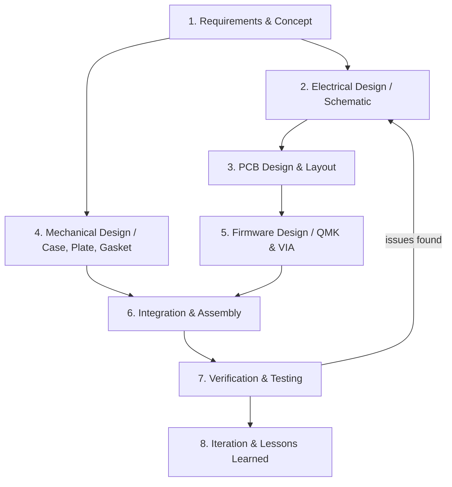

# Prototype Carbon — A Custom 65% Mechanical Keyboard

A 65% mechanical keyboard I designed, built, and programmed from scratch.
It has 67 keys, split 3u spacebars, a gasket-mounted acrylic case, hot-swap sockets,
per-key RGB, and QMK firmware with VIA remapping.

**Watch the demo:**

[](https://www.youtube.com/watch?v=WMbd48JGXQo&ab_channel=XinlinWu)

---

## Project Overview

Prototype Carbon went through the whole design process, from requirements and a rough
architecture down to the schematic, board layout, case, firmware, and finally a working keyboard.

| System | Spec |
|---|---|
| Layout | 65%, 67 keys, standard stagger |
| Spacebars | 2x 3u split spacebars |
| Switch matrix | 5 rows x 15 columns, COL2ROW diodes |
| MCU | ATmega32u4-AU (QFP-44) at 16 MHz |
| Connectivity | USB-C |
| Firmware | QMK with VIA remapping enabled |
| RGB | 75x WS2812B LEDs (67 per-key + 8 underglow) on pin B0 |
| Switches | 67x Kailh hot-swap sockets |
| Mounting | Gasket mount, layered acrylic shell |
| Diodes | 67x SOD-123F |

---

## Design Requirements

| ID | Requirement |
|---|---|
| R1 | 65% form factor with a dedicated arrow cluster and nav column |
| R2 | Two 3u split spacebars for extra thumb inputs |
| R3 | Fully hot-swappable, so switches can be changed without soldering |
| R4 | Per-key RGB backlighting plus underglow on a single data line |
| R5 | USB-C connectivity and standard HID, no drivers needed |
| R6 | Keys remappable live through VIA |
| R7 | A soft, gasket-mounted typing feel in a stacked acrylic case |
| R8 | A function layer with F1–F12 and RGB controls |

---

## System Architecture

```
+--------------------------------------------------------------------------+
|                                HOST (PC)                                  |
|                         USB-C  /  HID keyboard                            |
+------------------------------------+-------------------------------------+
                                     | USB
+------------------------------------v-------------------------------------+
|  ATmega32u4-AU at 16 MHz            +-----------------------------------+ |
|  QMK firmware (+VIA)                |  RGB matrix (WS2812B, pin B0)     | |
|                                     |  75 LEDs: 67 per-key + 8 underglow| |
|  +---------------+                  +-----------------------------------+ |
|  | 5x15 switch   |                                                     | |
|  | matrix        |  <- 67x Kailh hot-swap sockets + SOD-123F diodes    | |
|  | (COL2ROW)     |                                                     | |
|  +---------------+                                                     | |
|   (EC11 rotary encoder is routed but not usable, see Known Issues)      | |
+--------------------------------------------------------------------------+
```

**Signal flow:** a key press closes a switch in the matrix, the MCU scans the rows and columns
(COL2ROW), QMK debounces the input and maps it to a keycode, then sends a USB HID report to the
host. At the same time, QMK's RGB matrix drives all 75 WS2812B LEDs over a single data pin.

---

## Systems Design Process

This was an iterative process. Each step produced the files that fed into the next one, and
testing fed problems back into earlier steps.



### Phase 1 — Requirements & Concept

I started with the layout, deciding where every key sits and how big the modifiers and spacebars
should be, before committing to any hardware.

- **Layout spec (KLE):** [layout.txt](./layout.txt) — the 67-key 65% layout with split 3u spacebars
- **Layout model:** [protocarbon.json](./protocarbon.json) — keyboard-layout-editor JSON
- **Keymap matrix:** [prototypeCarbonVIA.json](./prototypeCarbonVIA.json) — the 5x15 matrix and VIA layout

### Phase 2 — Electrical Design (Schematic)

Next came the schematic: an ATmega32u4 with a 16 MHz crystal, USB-C, the COL2ROW switch matrix,
the per-key RGB chain, and the usual decoupling caps.

- **Schematic:** [SCH_prototypeCarbon_2025-07-03.json](./SCH_prototypeCarbon_2025-07-03.json)
- **Bill of materials:** [BOM_prototypeCarbon_2025-07-03.csv](./BOM_prototypeCarbon_2025-07-03.csv)
- **Shopping list:** [prototypeCarbonShoppingList - BOM_prototypeCarbon_2025-07-03.csv](./prototypeCarbonShoppingList%20-%20BOM_prototypeCarbon_2025-07-03.csv)

### Phase 3 — PCB Design & Layout

Then I routed the board, placed the hot-swap sockets and per-key LEDs, and exported the files
needed for manufacturing.

- **PCB design:** [PCB_PCB_prototypeCarbon_2025-07-03.json](./PCB_PCB_prototypeCarbon_2025-07-03.json)
- **PCB outline (DXF):** [PCB_prototypeCarbon_2025-07-05.dxf](./PCB_prototypeCarbon_2025-07-05.dxf)
- **PCB outline, revised:** [PCB_prototypeCarbon_2025-07-05 gai.dxf](./PCB_prototypeCarbon_2025-07-05%20gai.dxf)
- **Gerber files (fabrication):** [Gerber_prototypeCarbon_PCB_prototypeCarbon_2025-07-03.zip](./Gerber_prototypeCarbon_PCB_prototypeCarbon_2025-07-03.zip)

### Phase 4 — Mechanical Design (Case, Plate & Gasket)

The case came next: a gasket-mounted stack of laser-cut acrylic layers sized to match the PCB.

- **Acrylic shell stack (DWG):** [prototypeCarbonGasketShell.dwg](./prototypeCarbonGasketShell.dwg)
- **Acrylic plates (DWG):** [prototypeCarbonAcrylicPlates.dwg](./prototypeCarbonAcrylicPlates.dwg)
- **Stack drawing (DWG):** [stack.dwg](./stack.dwg)
- **Switch plate (DWG):** [plate1.dwg](./plate1.dwg) / (DXF) [plate1.dxf](./plate1.dxf)
- **Gasket (DWG):** [gasket.dwg](./gasket.dwg) / [prototypeCarbonGasket.dwg](./prototypeCarbonGasket.dwg)

### Phase 5 — Firmware Design (QMK + VIA)

With the hardware designed, I wrote the QMK firmware: matrix pins, COL2ROW, the WS2812B RGB
matrix, and a function layer, plus VIA support so keys can be remapped without reflashing.

- **Firmware directory:** [qmk_firmware/keyboards/prototypeCarbon](./qmk_firmware/keyboards/prototypeCarbon)
- **Hardware config:** `config.h`, `rules.mk` (matrix pins, RGB, VIA)
- **Keymaps:** `keymaps/default/keymap.c` and `keymaps/VIA/keymap.c`
- **Layer-2 keybind reference:** [layer2keybind.JPG](./layer2keybind.JPG)

### Phase 6 — Integration & Assembly

Assembly meant soldering the SMD parts (MCU, diodes, caps, LEDs, USB-C), snapping in the hot-swap
sockets, and bolting the case together.

- 24x M2 x 4 mm screws
- 12x M2 x 14 mm double-headed copper standoffs

### Phase 7 — Verification & Testing

I flashed the firmware and checked the whole system end to end.

- Passed: key matrix scan across all 67 keys
- Passed: RGB chain (67 per-key + 8 underglow) on a single data pin
- Passed: VIA detection and live remapping
- Failed: EC11 rotary encoder — see Known Issues below

### Phase 8 — Iteration & Lessons Learned

Testing caught a routing mistake on the rotary encoder (EC11 wired to AREF). I documented it,
isolated it, and worked around it. A proper fix would need a schematic and PCB re-spin.

---

## How to Build This Keyboard

1. **Print the PCB** — [Gerber_prototypeCarbon_PCB_prototypeCarbon_2025-07-03.zip](./Gerber_prototypeCarbon_PCB_prototypeCarbon_2025-07-03.zip)
2. **Print the case and plates** — [prototypeCarbonGasketShell.dwg](./prototypeCarbonGasketShell.dwg) and [gasket.dwg](./gasket.dwg)
3. **Order the electrical components** — [BOM_prototypeCarbon_2025-07-03.csv](./BOM_prototypeCarbon_2025-07-03.csv), plus:
   - 1x ATmega32u4AU microcontroller
   - 67x Kailh hot-swap sockets
   - 67x 6028RGBC-WS2812B RGB LEDs
4. **Buy the keyboard parts** — 67x switches, 67x keycaps, 24x M2 x 4 mm screws, 12x M2 x 14 mm standoffs
5. **Assemble** — keep the PCB in front of you while soldering, and double-check the LED and MCU pin orientation
6. **Compile the firmware** — use QMK_MSYS in [qmk_firmware/keyboards/prototypeCarbon](./qmk_firmware/keyboards/prototypeCarbon)
7. **Flash** — upload the compiled firmware with QMK Toolbox
8. **Configure in VIA** — load [prototypeCarbonVIA.json](./prototypeCarbonVIA.json) to view or remap the keymap

---

## Known Issues

**EC11 rotary encoder pin error**

The EC11 rotary encoder is not wired correctly on the PCB — one of its pins connects to the AREF
pin on the ATmega32u4AU. Don't install it unless you fix this in hardware first; use a regular
hot-swap socket in its place for now.

---

## Repository Structure

| Path | Purpose |
|---|---|
| `layout.txt` / `protocarbon.json` | Layout concept (KLE) |
| `SCH_prototypeCarbon_2025-07-03.json` | Schematic |
| `PCB_PCB_prototypeCarbon_2025-07-03.json` | PCB layout |
| `Gerber_*.zip` | PCB fabrication files |
| `*.dwg` / `*.dxf` | Case, plates, gasket (mechanical) |
| `BOM_*.csv` | Bill of materials |
| `prototypeCarbonVIA.json` | VIA keymap definition |
| `qmk_firmware/keyboards/prototypeCarbon/` | QMK firmware |
